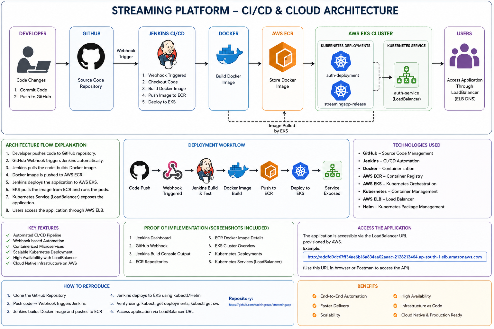
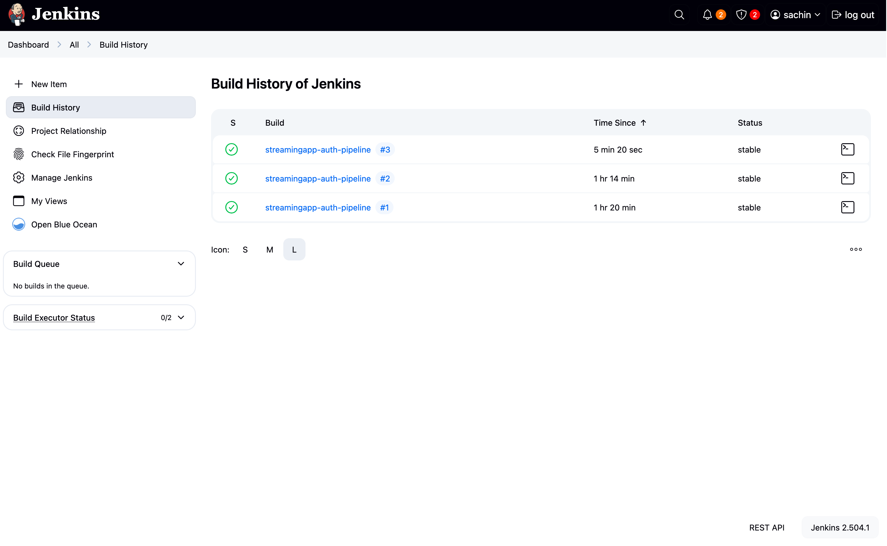
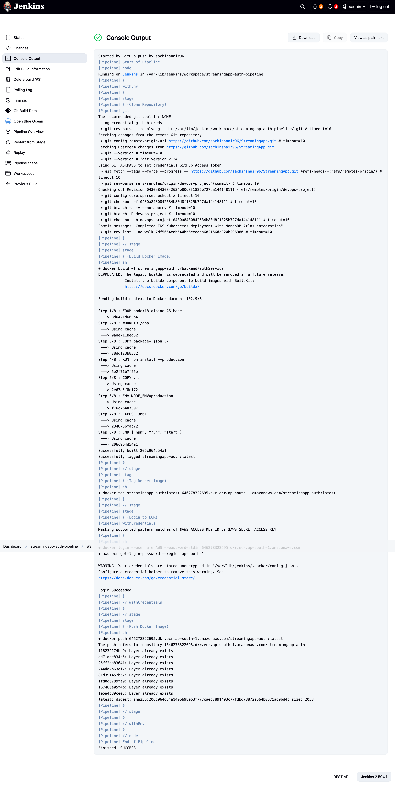
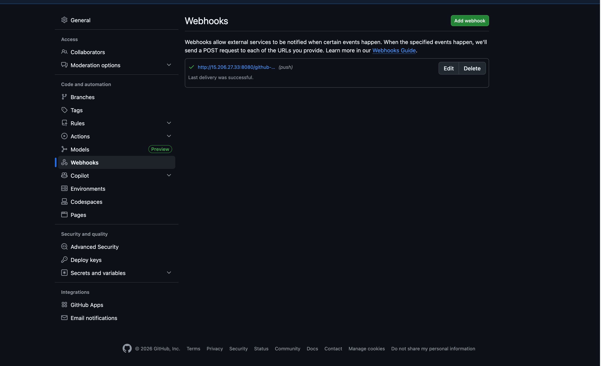
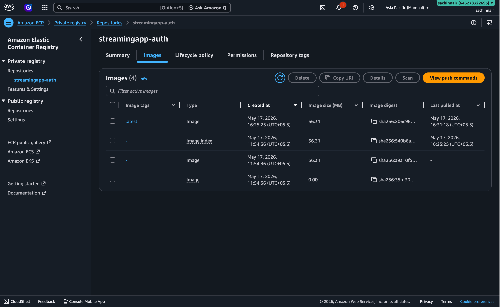
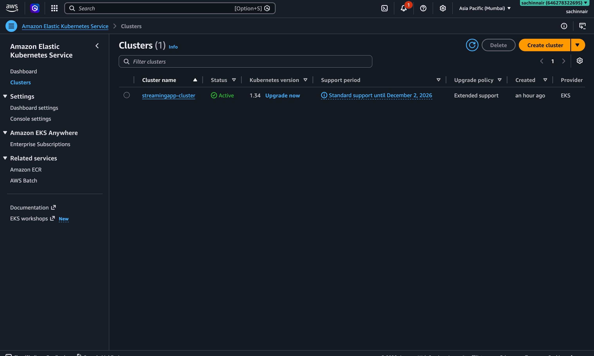
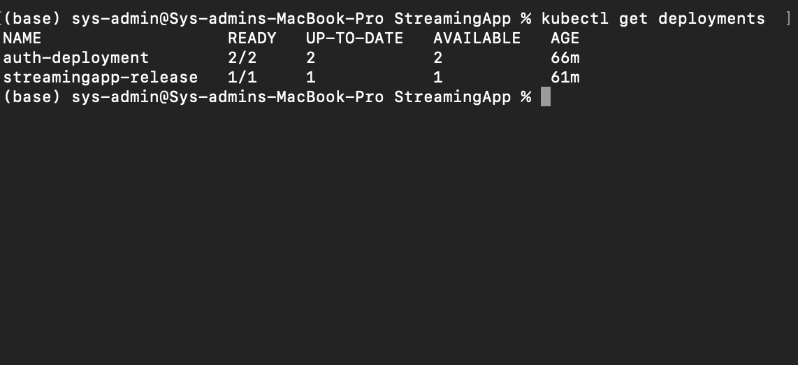
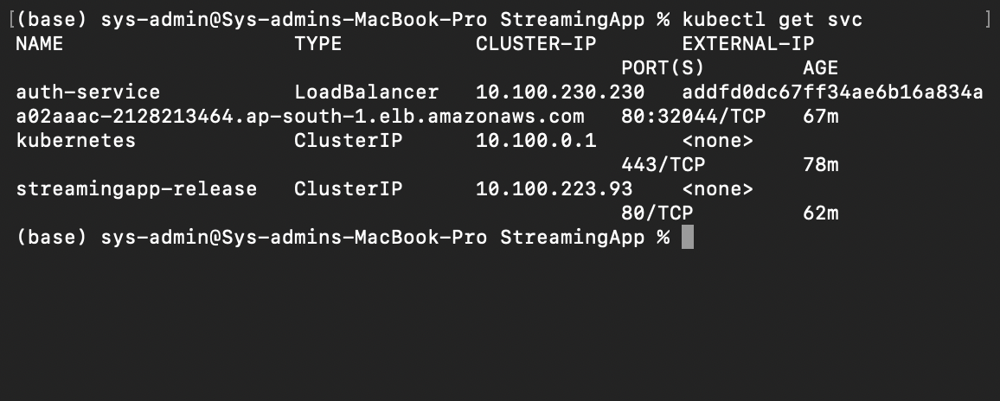

# StreamingApp — DevOps Project Report

## Project Overview

StreamingApp is a cloud-native microservices-based streaming platform developed using the MERN stack and deployed using modern DevOps tools and Kubernetes orchestration.

The project demonstrates:

* CI/CD automation using Jenkins
* Docker containerization
* AWS Elastic Container Registry (ECR)
* Amazon Elastic Kubernetes Service (EKS)
* Kubernetes orchestration and scaling
* Helm deployment management
* MongoDB Atlas cloud database integration
* AWS LoadBalancer exposure

The platform follows a microservices architecture consisting of:

* Authentication Service
* Streaming Service
* Administration Service
* Chat Service
* Frontend React Application

---

# Project Architecture



Figure 1: End-to-end CI/CD and cloud-native deployment architecture using GitHub, Jenkins, Docker, AWS ECR, Amazon EKS, Kubernetes, and LoadBalancer services.

---

# Technology Stack

| Category             | Technologies Used   |
| -------------------- | ------------------- |
| Frontend             | React.js            |
| Backend              | Node.js, Express.js |
| Database             | MongoDB Atlas       |
| Containerization     | Docker              |
| CI/CD                | Jenkins             |
| Source Control       | GitHub              |
| Container Registry   | AWS ECR             |
| Orchestration        | Kubernetes          |
| Kubernetes Platform  | Amazon EKS          |
| Deployment Packaging | Helm                |
| Cloud Provider       | AWS                 |

---

# Microservices Architecture

| Service          | Description                       | Port |
| ---------------- | --------------------------------- | ---- |
| authService      | Authentication and JWT management | 3001 |
| streamingService | Video streaming APIs              | 3002 |
| adminService     | Admin panel and video management  | 3003 |
| chatService      | Real-time chat using Socket.IO    | 3004 |
| frontend         | React frontend application        | 3000 |

---

# CI/CD Workflow

The project implements a complete DevOps CI/CD workflow:

1. Developer pushes code to GitHub repository.
2. GitHub Webhook triggers Jenkins pipeline automatically.
3. Jenkins pulls latest source code.
4. Docker images are built for microservices.
5. Jenkins authenticates with AWS ECR.
6. Docker images are pushed to AWS ECR.
7. Kubernetes deployments are updated on Amazon EKS.
8. Services are exposed through AWS LoadBalancer.

---

# Docker Containerization

All services were containerized using Docker.

Features implemented:

* Isolated application environments
* Reproducible deployments
* Multi-container architecture
* Docker Compose integration
* Cloud-ready deployment packaging

Docker images were stored in AWS Elastic Container Registry (ECR).

---

# Jenkins CI/CD Pipeline

Jenkins was configured on AWS EC2 to automate Docker builds and deployment workflows.

Pipeline stages include:

* GitHub Checkout
* Docker Build
* AWS ECR Login
* Docker Push
* Deployment Automation

## Jenkins Dashboard



Figure 2: Jenkins CI/CD build history showing successful automated pipeline executions triggered through GitHub webhook integration.

## Successful Jenkins Pipeline Execution



Figure 3: Successful Jenkins CI/CD pipeline execution demonstrating automated GitHub integration, Docker image build, AWS ECR authentication, and deployment workflow.

---

# GitHub Webhook Integration

GitHub Webhooks were configured to automatically trigger Jenkins pipelines whenever source code changes were pushed to the repository.



Figure 4: GitHub webhook successfully integrated with Jenkins for automatic CI/CD pipeline triggering.

---

# AWS Elastic Container Registry (ECR)

Docker images generated by Jenkins pipelines were pushed to AWS Elastic Container Registry.



Figure 5: Docker authentication microservice image successfully pushed to AWS Elastic Container Registry (ECR).

---

# Amazon EKS Cluster

Amazon Elastic Kubernetes Service (EKS) was used for Kubernetes orchestration and scalable deployment.

Implemented Kubernetes features:

* Kubernetes Deployments
* Replica Scaling
* Service Discovery
* Self-Healing Pods
* AWS LoadBalancer Integration
* Helm-based Deployment



Figure 6: Active Amazon Elastic Kubernetes Service (EKS) cluster configured for scalable microservices deployment.

---

# Kubernetes Deployments

Microservices were deployed into Kubernetes pods using deployment manifests.

Implemented:

* Deployment manifests
* Replica management
* Kubernetes networking
* Service orchestration
* Cloud-native deployment



Figure 7: Kubernetes deployments successfully running inside the Amazon EKS cluster with healthy and available microservice replicas.

---

# Kubernetes LoadBalancer Service

AWS Elastic LoadBalancer was integrated with Kubernetes services to expose backend APIs externally.



Figure 8: Kubernetes LoadBalancer service successfully exposing backend authentication microservice through AWS Elastic Load Balancer integration.

---

# MongoDB Atlas Integration

MongoDB Atlas cloud database was integrated with Kubernetes microservices.

Features implemented:

* Cloud-hosted MongoDB cluster
* Secure database authentication
* Kubernetes environment variable configuration
* External cloud database connectivity
* Production-style deployment architecture

---

# Helm Deployment

Helm charts were used for Kubernetes package management and deployment orchestration.

Implemented:

* Helm chart creation
* Helm release deployment
* Kubernetes application packaging
* Simplified deployment lifecycle management

---

# Scaling and Orchestration

Kubernetes orchestration capabilities demonstrated:

* Replica scaling
* Kubernetes scheduling
* Pod recovery and self-healing
* Service discovery
* LoadBalancer networking
* Cloud-native deployment management

---

# Challenges Faced

During implementation several deployment and orchestration challenges were encountered and resolved:

* Docker image build configuration
* AWS ECR authentication setup
* Jenkins pipeline debugging
* Kubernetes deployment troubleshooting
* MongoDB connectivity issues
* CrashLoopBackOff debugging
* Environment variable configuration
* AWS LoadBalancer networking setup

These challenges were resolved through Kubernetes debugging and cloud infrastructure configuration.

---

# Future Improvements

Potential future enhancements include:

* Kubernetes Ingress Controller
* HTTPS/SSL configuration
* Horizontal Pod Autoscaler (HPA)
* AWS CloudWatch monitoring
* Centralized logging
* Kubernetes Secrets management
* Multi-environment deployments
* Production-grade Helm values configuration

---

# Implementation Proof and Screenshots

## Jenkins CI/CD Dashboard


Figure 9: Jenkins CI/CD build history showing successful automated pipeline executions.

---

## Successful Jenkins Pipeline Execution


Figure 10: Successful Jenkins pipeline execution demonstrating Docker build and AWS ECR deployment workflow.

---

## GitHub Webhook Integration


Figure 11: GitHub webhook configured for automatic Jenkins pipeline triggering.

---

## AWS Elastic Container Registry (ECR)


Figure 12: Docker container image successfully pushed to AWS Elastic Container Registry.

---

## Amazon EKS Cluster


Figure 13: Active Amazon EKS cluster configured for Kubernetes orchestration.

---

## Kubernetes Deployments


Figure 14: Kubernetes deployments successfully running inside the EKS cluster.

---

## Kubernetes LoadBalancer Service


Figure 15: Kubernetes LoadBalancer service exposing backend microservices externally.

---

## System Architecture Diagram


Figure 16: End-to-end cloud-native DevOps deployment architecture.

---

# Repository Structure

```bash
├── backend
│   ├── adminService
│   ├── authService
│   ├── chatService
│   └── streamingService
├── frontend
├── k8s
├── screenshots
├── docker-compose.yml
├── README.md
├── DEVOPS_PROJECT_REPORT.md
└── LICENSE
```

---

# Conclusion

This project successfully demonstrates the deployment and orchestration of a MERN microservices streaming platform using modern DevOps practices and cloud-native infrastructure.

The implementation integrates:

* CI/CD automation
* Docker containerization
* AWS cloud infrastructure
* Kubernetes orchestration
* Helm deployment management
* MongoDB Atlas integration
* Scalable microservices deployment

The project showcases production-style DevOps workflows using Amazon Web Services and Kubernetes-based cloud deployment.

---

# Author

Sachin S Nair

